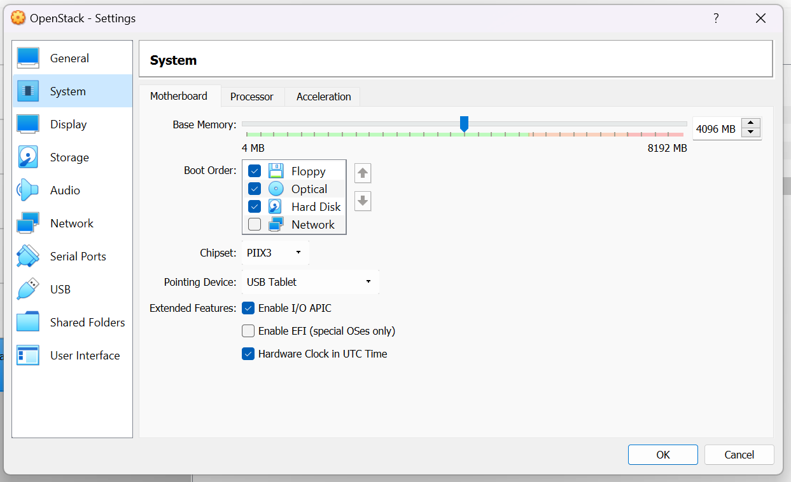
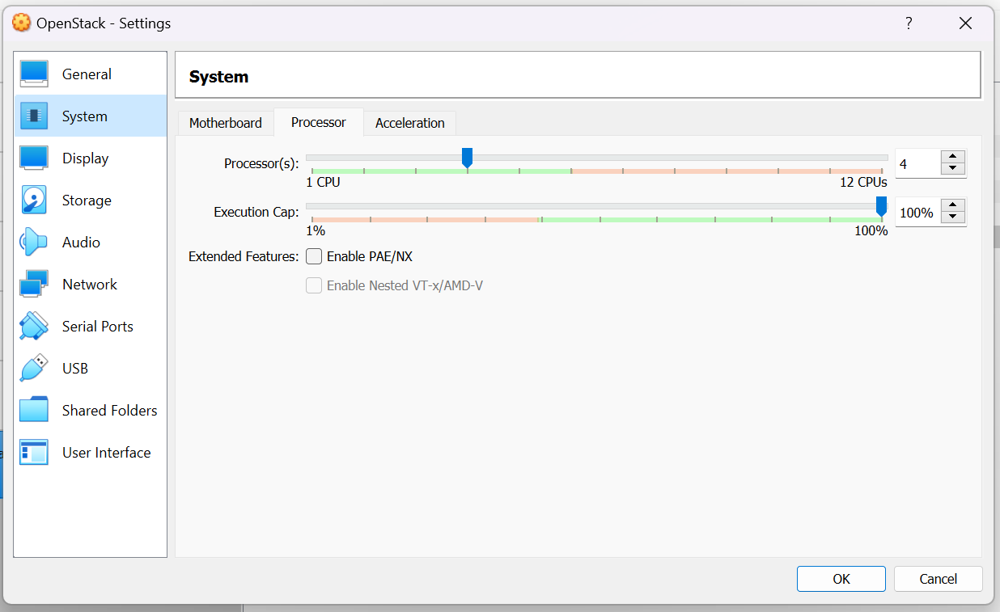
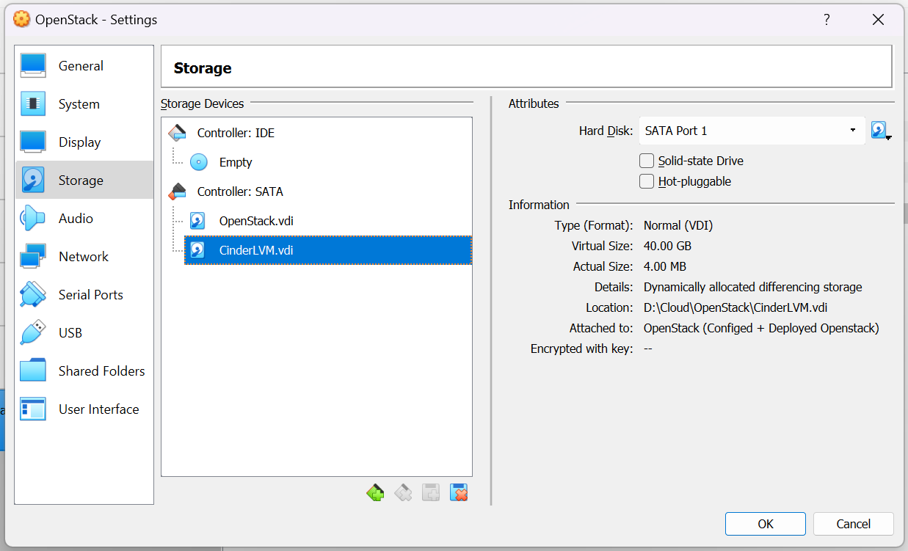
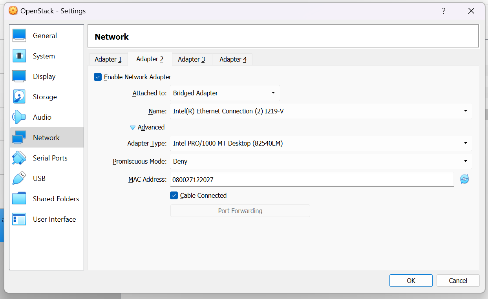

# Deploy OpenStack with Kolla-Ansible

Editor: **Do Bao Hoang**

---
## Table of contents
[I. Introduction](#intro)
- [1. OpenStack](#openstack)
- [2. Kolla](#kolla)
- [3. Ansible](#ansible)

[II. System requirements](#requirements)

[III. Deployment](#deployment)
- [1. Setup VM](#vmSetup)
- [2. Install Dependencies](#dependencies)
- [3. Install Ansible requirements](#ansibleRequirement)
- [4. Deploy OpenStack](#deployOpenstack)

[IV. Encountered Errors](#errors)

[V. References](#references)

---
## I. Introduction <a name='intro'></a>

### 1. OpenStack <a name='openstack'></a>
**OpenStack** là một platform điện toán đám mây nguồn mở hỗ trợ cả `public clouds` và `private clouds`. Nó cung cấp giải pháp xây dựng hạ tầng điện toán đám mây đơn giản, có khả năng mở rộng và nhiều tính năng phong phú.

<div align="center">
  
</div>

<div align="center">
  <i>Pic. 1 - OpenStack logo</i>
</div>

Ban đầu, **OpenStack** được phát triển bởi **NASA** và **Rackspace**, phiên bản đầu tiên vào năm 2010. Định hướng của họ từ khi mới bắt đầu là tạo ra một dự án nguồn mở mà mọi người có thể sử dụng hoặc đóng góp. OpenStack dưới chuẩn `Apache License 2.0,` vì thế phiên bản đầu tiên đã phát triển rộng rãi trong cộng đồng được hỗ trợ bởi hơn 12000 cộng tác viên trên gần 130 quốc gia, và hơn 150 công ty bao gồm *Redhat*, *Canonical*, *IBM*, *AT&T*, *Cisco*, *Intel*, *PayPal*, *Comcast* và một nhiều cái tên khác. 

**OpenStack** được phát triển theo chu kỳ 6 tháng. Sau mỗi bản phát hành thử nghiệm sẽ có các bản phát hành ổn định (stable released).

*Table 1 - OpenStack Last 5 Releases*
| Series | Status | Initial Release Date |
|--------|--------|----------------------|
| 2023.1 Antelope | Development | 2023-03-22 estimated (schedule) |
| Zed | Maintained | 2022-10-05 | 
| Yoga | Maintained | 2022-03-30 |
| Xena | Maintained | 2021-10-06 |
| Wallaby | Maintained | 2021-04-14 |

**OpenStack** không phải là một dự án đơn lẻ mà là một nhóm các dự án nguồn mở nhằm mục đích cung cấp các dịch vụ cloud hoàn chỉnh. **OpenStack** chứa nhiều thành phần:

- **OpenStack compute** (`Nova`): là module quản lý và cung cấp máy ảo. Nó hỗ trợ nhiều hypervisors gồm KVM, QEMU, LXC, XenServer... Compute là một công cụ mạnh mẽ mà có thể điều khiển toàn bộ các công việc: networking, CPU, storage, memory, tạo, điều khiển và xóa bỏ máy ảo, security, access control.
- **OpenStack Image Service** (`Glance`): là module quản lý các disk image ảo. Glance hỗ trợ các ảnh Raw, Hyper-V (VHD), VirtualBox (VDI), Qemu (qcow2) và VMWare (VMDK, OVF). Bạn có thể thực hiện: cập nhật thêm các virtual disk images, cấu hình các public và private image và điều khiển việc truy cập vào chúng, và tất nhiên là có thể tạo và xóa chúng.
- **OpenStack Object Storage** (`Cinder`): dùng để quản lý lưu trữ. Nó là một hệ thống lưu trữ phân tán cho quản lý tất cả các dạng của lưu trữ như: archives, user data, virtual machine image … Có nhiều lớp redundancy và sự nhân bản được thực hiện tự động, do đó khi có node bị lỗi thì cũng không làm mất dữ liệu, và việc phục hồi được thực hiện tự động.
- **Identity Server** (`Keystone`): quản lý xác thực cho user và projects.
- **OpenStack Netwok** (`Neutron`): là thành phần quản lý network cho các máy ảo. Cung cấp chức năng network as a service. Đây là hệ thống có các tính chất pluggable, scalable và API-driven.
- **OpenStack dashboard** (`Horizon`): cung cấp cho người quản trị cũng như người dùng giao diện đồ họa để truy cập, cung cấp và tự động tài nguyên cloud. Việc thiết kế có thể mở rộng giúp dễ dàng thêm vào các sản phẩm cũng như dịch vụ ngoài như billing, monitoring và các công cụ giám sát khác.

### 2. Kolla <a name='kolla'></a>

**Openstack Kolla** là Project hay công cụ sử dụng để triển khai, vận hành **Openstack**. **Kolla** được phát hành từ phiên bản `Kilo` và chính thức trở thành Project Openstack tại phiên bản `Liberty`.

Với ý tưởng của **Project Kolla** là triển khai **Openstack** trong môi trường `Container`, tự động triển khai **Openstack** bằng Kolla Ansible. Qua đó chỉ với 1 vài thao tác, chúng ta đã có môi trường **Openstack** để sử dụng. Hơn nữa, **Project Kolla** cũng cung cấp sẵn các giải pháp về giám sát, HA, Rolling Upgrades … cho **Openstack**

<div align="center">
  
</div>

<div align="center">
  <i>Pic. 2 - Kolla logo</i>
</div>

**Kolla** gồm có 3 dự án chính:

- `Kolla-ansible`: triển khai các container của Kolla bằng Ansible
- `Kayobe`: triển khai OpenStack control plane trên máy bare metal sử dụng Kolla-ansible và Bifrost
- `Ansible-collection-kolla`: cung cấp các ứng dụng Ansible phổ biến được sử dụng bởi các dự án Kolla

**Kolla** cũng có các phiên bản stable tương ứng với **OpenStack**.

*Table 2 - Kolla and OpenStack Last Releases*
| Kolla Series | OpenStack Series |
|--------------|------------------|
| `15.1.x.x` | `lastest` |
| `15.0.x.x` | Zed |
| `14.x.x` | Yoga | 
| `13.x.x` | Xena | 
| `12.x.x` | Wallaby | 

### 3. Ansible <a name='ansible'></a>

**Ansible** là một trong những công cụ quản lý cấu hình hiện đại, nó tạo điều kiện thuận lợi cho công việc cài đặt, quản lý và bảo trì các server từ xa, với thiết kế tối giản giúp người dùng cài đặt và chạy nhanh chóng.

<div align="center">
  
</div>

<div align="center">
  <i>Pic. 3 - Ansible logo</i>
</div>

**Ansible** sử dụng kiến trúc `agentless` không cần đến agent để giao tiếp với các máy khác. Cơ bản nhất là giao tiếp thông qua các giao thức `WinRM` trên Windows, `SSH` trên Linux hoặc giao tiếp qua chính `API` của thiết bị đó cung cấp.

Để hiểu và áp dụng **Ansible** một cách hiệu quả, các bạn cần nắm rõ một số thuật ngữ được sử dụng như: ***Controller Machine***, ***Inventory***, ***Playbook***, ***Task***, ***Module***, ***Role***, ***Play***, ***Facts***, ***Handlers***, ***Variables***, ***Conditions***.

**Ansible** có 2 dự án cộng đồng chính: `Ansible community package` và `Ansible-core`

*Table 3 - Compare Ansible community project*
| Ansible community package | ansible-core |
|---------------------------|--------------|
| Uses new versioning (2.10, then 3.0.0) | Continues “classic Ansible” versioning (2.11, then 2.12) |
| Follows semantic versioning rules | Does not use semantic versioning |
| Maintains only one version at a time | Maintains latest version plus two older versions | 
| Includes language, runtime, and selected Collections | Includes language, runtime, and builtin plugins | 
| Developed and maintained in Collection repositories | Developed and maintained in ansible/ansible repository | 


---
## II. System requirements <a name='requirements'></a>

Trong bài thực hành này mình sẽ sử dụng VM Ubuntu (Ubuntu 22.04 LSTM) chạy trên Virtual Box. 
Để cài đặt phiên bản Kolla-ansible `15.1.0` cùng OpenStack `lastest` theo [hướng dẫn](https://docs.openstack.org/kolla-ansible/latest/user/quickstart.html#top) cấu hình gợi ý gồm có:

*Table 4 - System requirements*
| Specification | Require | Personal VM |
|----------------|---------|-------------|
| CPU | 4 cores | 4 cores |
| RAM | 8 GB | 4 GB |
| Disk | 2 (atleast 40 GB) |  2 (40 - 40 GB) | 
| network | 2 NICs |  2 NICs | 

Tuy nhiên do cấu hình máy có giới hạn nên cấu hình RAM chỉ giới hạn ở mức 4 GB.

---
## III. Deployment <a name='deployment'></a>

### 1. Setup VM <a name='vmSetup'></a>

Đầu tiên cần chỉnh cài đặt RAM cho VM lên 4 GB bằng cách vào `setting -> system -> Motherboard`:

<div align="center">
  
</div>

<div align="center">
  <i>Pic. 4 - Ram setting</i>
</div>

Để thay đổi số lượng nhân CPU ta chuyển sang tab `Processor`:

<div align="center">
  
</div>

<div align="center">
  <i>Pic. 5 - CPU setting</i>
</div>

Vào `setting -> Storage` sau đó ấn nút `Adds hard disk` để thêm ổ đĩa mới với dung lượng 40 GB:

<div align="center">
  
</div>

<div align="center">
  <i>Pic. 6 - Add new hard disk</i>
</div>

Cuối cùng để cài đặt network vào `setting -> Network`. Theo mặc định VM có sẵn 1 mạng `NAT` với IP `192.168.0.113`, cần thêm 1 mạng `Bridged Adapter` không có IP nữa:

<div align="center">
  
</div>

<div align="center">
  <i>Pic. 7 - Add new NIC</i>
</div>


### 2. Install Dependencies <a name='dependencies'></a>

Đầu tiên cần cài đặt `python3` và `gcc` cùng các package liên quan

```
sudo apt update
sudo apt install git python3-dev libffi-dev gcc libssl-dev
```

Cài đặt môi trường ảo cho ansible

```
sudo apt install python3-venv
python3 -m venv openstack
source openstack/bin/activate
```

Cài đặt Ansible. Vì sử dụng dụng OpenStack `lastest` nên Kolla Ansible phải từ phiên bản 4 đến 5

```
pip install -U pip
pip install 'ansible>=4,<6'
```

Sau khi cài đặt Ansible, Kolla-ansible đã có thể được cài:

```
pip install git+https://opendev.org/openstack/kolla-ansible@master
sudo mkdir -p /etc/kolla
sudo chown $USER:$USER /etc/kolla
```

Ta cần copy 2 file example `globals.yml` và `passwords.yml` đến `/etc/kolla`. File all-in-one sẽ được copy ra ngoài Desktop để làm inventory cho Ansible

```
cp -r openstack/share/kolla-ansible/etc_examples/kolla/* /etc/kolla
cp openstack/share/kolla-ansible/ansible/inventory/all-in-one .
```

### 3. Install Ansible requirements <a name='ansibleRequirement'></a>

Ansible Galaxy được đóng gói cùng 1 bản cài giúp dễ dàng cài đặt:

```
kolla-ansible install-deps
```

Tiếp theo ta cần config cho Kolla sử dụng file globals.yml

```yml
kolla_base_distro: "ubuntu"

network_interface: "enp0s3"
neutron_external_interface: "enp0s8"
kolla_internal_vip_address: "192.168.0.113"

nova_compute_virt_type: "qemu"

enable_haproxy: "no"

enable_cinder: "yes"
enable_cinder_backup: "no"
enable_cinder_backend_lvm: "yes"
```

- **kolla_base_distro**: Our Linux distribution - ubuntu
- **network_interface**: internal network interface communicate with OpenStack.
- **neutron_external_interface**: provider network interface for VMs.
- **kolla_internal_vip_address**: IP address of network_interface, prevent errors when MariaDB connect with HAproxy.
- **nova_compute_virt_type**: we use VM, so here we set it is qemu.
- **enable_haproxy**: no for all-in-one.
- *enable_cinder*: we use Cinder LVM use share storage for OpenStack, so we set yes here.
- **enable_cinder_backup**: We don't use Backup Cinder, so we set no hrer.
- **enable_cinder_backend_lvm**: we use Backend LVM for Cinder , so we set yes here.

Tuy nhiên hiện tại trong file passwords.yml vẫn trống và cần có password để khởi chạy. Có thể tự config password riêng hoặc random password bằng lệnh:

```
kolla-genpwd
```

Cuối cùng, vì đã config LVM Cinder nên ta cần tạo volume group cho ổ cứng sử dụng LVM:

```
pvcreate /dev/sdb
vgcreate cinder-volumes /dev/sdb
```

### 4. Deploy OpenStack <a name='deployOpenstack'></a>

Kolla Ansible cung cấp một playbook sẽ cài đặt tất cả các dịch vụ cần thiết. Chỉ cần chạy lệnh:

```
kolla-ansible -i ./all-in-one bootstrap-servers
```

Sau khi hoàn tất cài đặt sẽ có kết quả như sau:

<div align="center">
  
</div>

<div align="center">
  <i>Pic. 8 - Result after bootstrap-servers</i>
</div>

Tiếp đến cần chạy lệnh prechecks để kiểm tra kết nối đến host:

```
kolla-ansible -i ./all-in-one prechecks
```

Sau khi hoàn tất kiểm tra sẽ có kết quả như sau:

<div align="center">
  
</div>

<div align="center">
  <i>Pic. 9 - Result after prechecks</i>
</div>

Bước cuối cùng và cũng là quan trọng nhất là triển khai OpenStack:

```
kolla-ansible -i ./all-in-one deploy
```

Sau khi hoàn tất sẽ có kết quả như hình:

<div align="center">
  
</div>

<div align="center">
  <i>Pic. 10 - Result after deploy</i>
</div>

Để sử dụng OpenStack còn cần phải cài đặt OpenStack CLI client:

```
pip install python-openstackclient -c https://releases.openstack.org/constraints/upper/master
```

OpenStack lưu thông tin đăng nhập cho admin và user trong file clouds.yaml. Để tạo file này tự động ta dùng câu lệnh:

```
kolla-ansible post-deploy
```

Để xem mật khẩu cho admin ta có thể xem trong đường dẫn `/etc/kolla/clouds.yaml`

Sau khi đăng nhập tài khoản admin thành công sẽ có kết quả như hình dưới:

<div align="center">
  
</div>

<div align="center">
  <i>Pic. 11 - Result after login with admin credentials</i>
</div>

---
## IV. Encountered Errors
<a name='errors'></a>

- MariaDB liveness error
- Not create volume group for Cinder LVM
- Re-generate password after changing config file
- Remove container before re-deploy OpenStack
- Permission denied

---
## V. References
<a name='references'></a>
https://docs.openstack.org/kolla-ansible/latest/user/quickstart.html

https://news.cloud365.vn/openstack-kolla-phan-1-huong-dan-cai-dat-openstack-train-all-in-one-bang-kolla-ansible/

https://docs.openstack.org/kolla/latest/

https://docs.openstack.org/kolla-ansible/xena/reference/compute/libvirt-guide.html

https://docs.openstack.org/kolla-ansible/queens/reference/cinder-guide.html

https://docs.docker.com/engine/reference/commandline/rm/